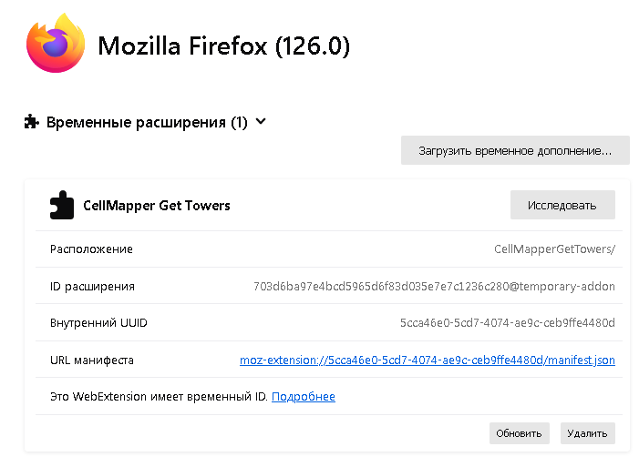

# CellMapperGetTowers for Firefox

**[CellMapper.net](https://www.cellmapper.net/map) Get Towers** allow to save received cell towers via browsing map into csv table in Firefox.    
**[CellMapper.net](https://www.cellmapper.net/map) Get Towers** позволяет сохранять полученные сотовые вышки при навигации по карте на сайте в Firefox'е.        

How to use | Как использовать:
- Add `manifest.json` to Firefox Extentions | Добавьте `manifest.json` во временные расширения Firefox'a:
- [about:debugging#/runtime/this-firefox](about:debugging#/runtime/this-firefox)     
     
Supported API:   
- API v6    

    
    
